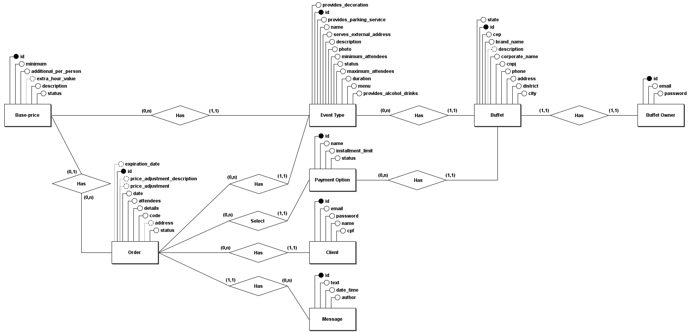

<h1 align="center">Cadê Buffet</h1>

<div align="center">
  
  
  
  
  
  
  
</div>

Buffet finder platform to intermediate orders between clients and buffets.

## Table of Contents

:diamonds: [What The Application Can Do](#what-the-application-can-do)

:diamonds: [API Endpoints](#api-endpoints)

:diamonds: [Dependencies](#dependencies)

:diamonds: [How to Run the Application](#how-to-run-the-application)

:diamonds: [Extra Gems Used](#extra-gems-used)

:diamonds: [Entity-Relationship Diagram](#entity-relationship-diagram)

:diamonds: [Seeds](#seeds)

:diamonds: [Tests](#tests)

:diamonds: [Development Progress](#development-progress)

:diamonds: [License](#license)


## What The Application Can Do

:trophy: Create account for buffet owners and clients

:trophy: Register buffet

:trophy: Register event types for buffet

:trophy: Register prices for event types

:trophy: List buffets

:trophy: Search for buffets

:trophy: List event types

:trophy: Create, evaluate, confirm and cancel orders

:trophy: Exchange messages on orders

## API Endpoints

**Check my Vue.js app that consumes this API too: [cade-buffet-vue](https://github.com/ruliancruz/cade-buffet-vue)**

## Dependencies

:warning: [Ruby 3.3.0](https://rvm.io/)

:warning: [SQLite3](https://www.sqlite.org/)

:warning: [Node.js](https://nodejs.org/)

:warning: [Yarn](https://classic.yarnpkg.com/lang/en/docs/install/)

:warning: [Bundler](https://bundler.io/)

:warning: [Libvips42](https://packages.ubuntu.com/focal/libs/libvips42/)

:warning: [Rails 7.1.3.2](https://guides.rubyonrails.org/v5.0/getting_started.html)

## How to Run the Application

To run this application I suggest you to use a Unix-based system, my personal recommendation is to use the latest version of Ubuntu. If you have get errors while trying to set up the application to run, check if the dependencies are present and in the correct versions.

First you need to install **Ruby** with at least **3.3.0** version, I recommend you to use a version manager, like [**RVM**](https://rvm.io/).

Next you need to install **Rails**, to do it, open your terminal and type:

```
gem install rails
```

After that, to install all gem dependencies you will need to install **Bundler**, running:

```
bundler install
```

You're also going to need **Libvips42** to correctly process images.

So, if you're using apt-get, type:

```
sudo apt install libvips42
```

After that, you will have all dependencies.

Now, set up the database with:

```
rails db:setup
```

With that you'll have the application ready to use, to start the server type:

```
rails s
```

Now you can access the application through http://localhost:3000/ route.

## Extra Gems Used

This is automatically installed when you run Bundler, so you don't need to worry,

:gem: [cpf_cnpj](https://github.com/fnando/cpf_cnpj)

## Entity-Relationship Diagram



## Seeds

The application have seeds for buffet owners, buffets, event types, base prices, payment options and client to explore.

The seeds file is run on `rails db:setup`

All the data is fictional and generated by AI or random generators.

### Seeds Data

#### Client
| Field   | Value                |
|---------|----------------------|
| email   | client@example.com   |
| password| password             |
| name    | João da Silva        |
| cpf     | 28142464020          |
<br>

#### Buffet Owners
| email              | password  |
|--------------------|-----------|
| owner1@example.com | password1 |
| owner2@example.com | password2 |
| owner3@example.com | password3 |
| owner4@example.com | password4 |
| owner5@example.com | password5 |
<br>

#### Buffets
| brand_name              | corporate_name        | cnpj            | phone       | address             | district       | city          | state | cep       | description                                                         | buffet_owner_id |
|-------------------------|-----------------------|-----------------|-------------|---------------------|----------------|---------------|-------|-----------|---------------------------------------------------------------------|-----------------|
| Buffet da Maria         | Maria Ltda            | 51995596000148  | 11987654321 | Rua das Flores      | Centro         | São Paulo     | SP    | 02478150  | Buffet especializado em festas infantis.                           | 1               |
| Buffet do João          | João Buffet           | 74896924000154  | 11976543210 | Avenida Principal   | Bairro Novo    | Rio de Janeiro| RJ    | 77829146  | Buffet completo para casamentos e eventos corporativos.            | 2               |
| Buffet Encantado        | Encantado Festas      | 94500187000136  | 1133333333  | Rua das Estrelas    | Jardim Primavera| Curitiba     | PR    | 69306398  | O lugar perfeito para festas temáticas e eventos sociais.          | 3               |
| Buffet Sabores do Brasil| Sabores do Brasil Ltda| 00255206000162  | 1144444444  | Avenida Central     | Centro         | Brasília      | DF    | 69314142  | Buffet especializado em culinária brasileira para eventos corporativos.| 4               |
| Buffet do Carlos        | Carlos & Cia          | 21132671000186  | 1132323232  | Praça das Árvores   | Vila Verde     | Porto Alegre  | RS    | 41253244  | Buffet com cardápio variado para todos os tipos de eventos.        | 5               |
<br>

#### Event Types
| name               | description                                                  | minimum_attendees | maximum_attendees | duration | menu                                                                | provides_alcohol_drinks | provides_decoration | provides_parking_service | serves_external_address | buffet_id |
|--------------------|--------------------------------------------------------------|-------------------|-------------------|----------|---------------------------------------------------------------------|-------------------------|----------------------|--------------------------|-------------------------|-----------|
| Casamento          | Celebração do amor entre duas pessoas.                       | 50                | 200               | 120      | Buffet completo com opções de carne, peixe e vegetariano.           | 1                       | 1                    | 1                        | 0                       | 1         |
| Aniversário Infantil| Festa para celebrar o aniversário de uma criança.           | 20                | 50                | 80       | Cardápio infantil com salgadinhos, doces e bolo decorado.           | 0                       | 1                    | 1                        | 0                       | 2         |
| Evento Corporativo | Encontro de empresas para networking ou celebrações.        | 30                | 300               | 160      | Opções variadas de canapés, finger foods e bebidas.                 | 1                       | 0                    | 1                        | 1                       | 3         |
| Chá de Bebê        | Celebração do próximo bebê que está para chegar.            | 10                | 50                | 60       | Salgadinhos, bolos e doces diversos.                                | 0                       | 1                    | 1                        | 0                       | 4         |
| Formatura          | Celebração da conclusão de um curso ou etapa acadêmica.      | 50                | 200               | 100      | Buffet com opções de jantar e finger foods.                         | 1                       | 1                    | 1                        | 0                       | 5         |
| Festa de Noivado   | Celebração do compromisso de casamento.                     | 30                | 100               | 80       | Canapés, bebidas e bolo comemorativo.                               | 1                       | 1                    | 1                        | 0                       | 1         |
| Festa de Natal     | Celebração do Natal com amigos e familiares.                | 20                | 150               | 120      | Ceia natalina com peru, tender, e acompanhamentos típicos.          | 1                       | 1                    | 1                        | 0                       | 2         |
| Evento Cultural    | Evento para promover a cultura, arte e entretenimento.       | 50                | 500               | 200      | Lanches, petiscos e bebidas variadas.                               | 0                       | 1                    | 1                        | 1                       | 3         |
| Festa de Reveillon | Celebração do Ano Novo com fogos de artifício e festividades.| 50                | 300               | 160      | Buffet completo com pratos especiais para a virada do ano.          | 1                       | 1                    | 1                        | 0                       | 4         |
| Festa Junina       | Celebrando as tradições juninas com comidas típicas e danças.| 30                | 200               | 100      | Barracas com comidas típicas como milho verde, canjica, e quentão.  | 0                       | 1                    | 1                        | 0                       | 5         |
| Conferência        | Evento de grande porte com palestras e workshops.           | 100               | 1000              | 240      | Coffee breaks, almoços e jantares.                                  | 0                       | 0                    | 1                        | 1                       | 1         |
| Festa Temática     | Celebração com tema específico, como anos 80 ou tropical.    | 20                | 100               | 80       | Comida e bebida relacionadas ao tema da festa.                      | 1                       | 1                    | 1                        | 0                       | 2         |
| Desfile de Moda    | Apresentação das últimas tendências de moda.                | 50                | 500               | 120      | Petiscos e drinks especiais para os convidados.                     | 1                       | 0                    | 1                        | 1                       | 3         |
| Concerto           | Apresentação musical ao vivo.                                | 50                | 500               | 80       | Petiscos e bebidas durante o intervalo.                             | 0                       | 0                    | 1                        | 1                       | 4         |
| Festa de Halloween | Celebração do Dia das Bruxas com fantasias e decoração temática.| 20                | 150               | 100      | Petiscos assustadores e drinques especiais.                         | 1                       | 1                    | 1                        | 0                       | 5         |
| Encontro Familiar  | Reunião de familiares para confraternização.                | 10                | 100               | 60       | Churrasco, saladas e sobremesas.                                    | 1                       | 0                    | 1                        | 0                       | 1         |
| Feira de Negócios  | Evento para promover produtos e serviços de empresas.       | 100               | 1000              | 160      | Coffee breaks e almoços.                                            | 0                       | 0                    | 1                        | 1                       | 2         |
| Festa da Empresa   | Celebração de conquistas e metas alcançadas.                | 50                | 500               | 120      | Jantar completo e bebidas variadas.                                 | 1                       | 1                    | 1                        | 0                       | 3         |
| Retiro Espiritual  | Encontro para reflexão e práticas espirituais.              | 20                | 100               | 60       | Refeições leves e saudáveis.                                        | 0                       | 0                    | 1                        | 1                       | 4         |
| Festa de Carnaval  | Celebração do Carnaval com música e dança.                  | 30                | 200               | 100      | Petiscos típicos de Carnaval e bebidas refrescantes.                | 1                       | 1                    | 1                        | 0                       | 5         |
<br>

#### Payment Options
| name                 | installment_limit | buffet_id |
|----------------------|-------------------|-----------|
| Dinheiro             | 1                 | 1         |
| Cartão de Crédito    | 12                | 2         |
| Cartão de Débito     | 1                 | 3         |
| Transferência Bancária| 1                 | 4         |
| PIX                  | 1                 | 5         |
| Boleto Bancário      | 1                 | 1         |
| Cheque               | 1                 | 2         |
| Vale-Alimentação     | 1                 | 3         |
| Vale-Refeição        | 1                 | 4         |
| PayPal               | 1                 | 5

## Tests

This project was made using Test Driven Development and has tests for system, requests and models.

You can run all the tests running `rspec` in the project directory on terminal.

## Development Progress

Main Application: `In progress`

API: `In progress`

Swagger: `Coming soon`

Deploy: `Coming soon`

## License

The MIT License (MIT)
Copyright ©️ 2024 - Cadê Buffet